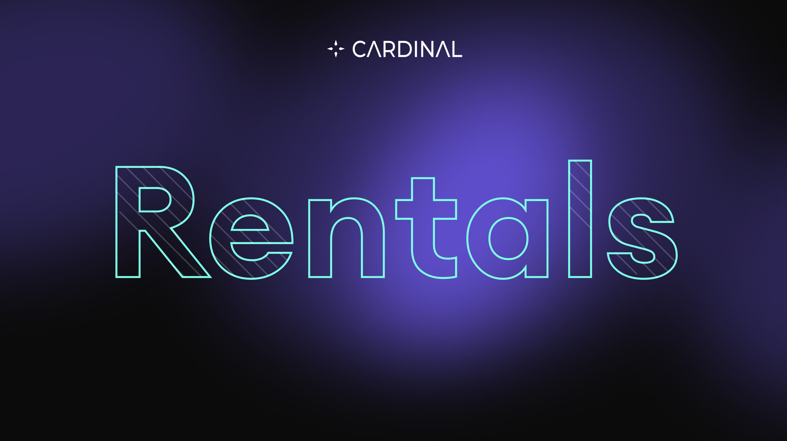

# Cardinal Rental UI

This repository hosts the UI inteface that powers **https://rent.cardinal.so** for renting NFTs on Solana blockchain.

Use this repo to view the code behind the rental-ui and see examples of how to use the SDK.

For questions or technical help, join our **[Discord](https://discord.gg/cardinallabs)**.

---

  

## Rentals

  

